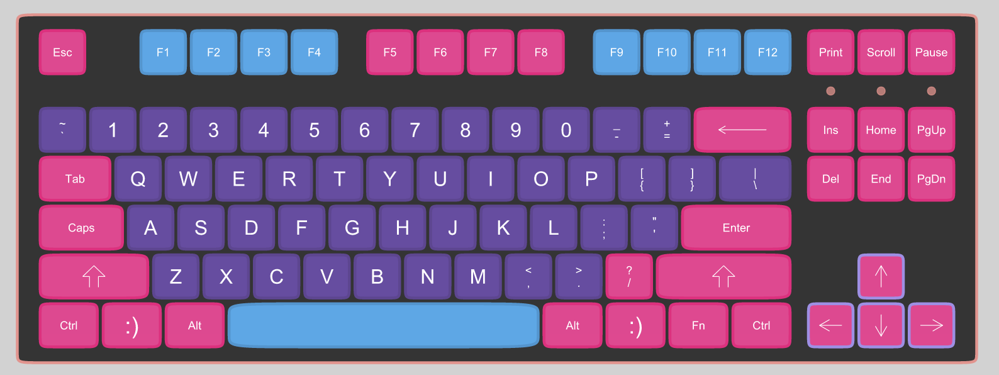
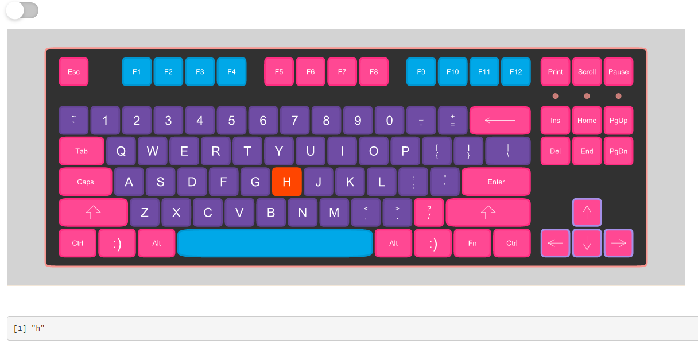
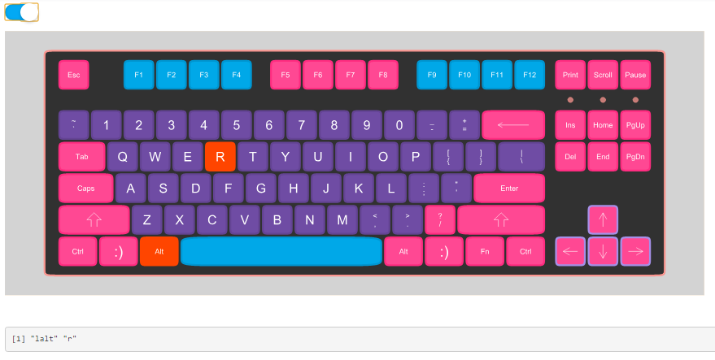
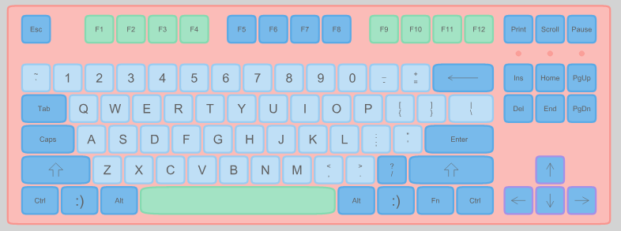
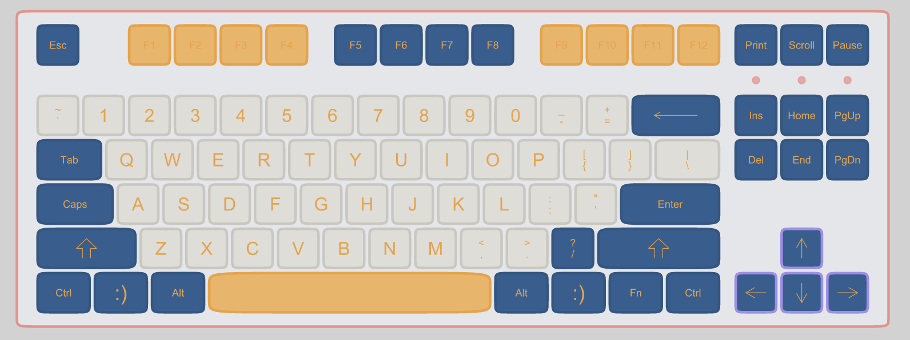

<!-- README.md is generated from README.Rmd. Please edit that file -->

# shinykeyboard

<!-- badges: start -->

<!-- badges: end -->

{shinykeyboard} is an R package to create an on-screen keyboard input
widget in R Shiny. The package converts beautiful keyboards from Sharla
Gelfand’s {[ggkeyboard](https://github.com/sharlagelfand/ggkeyboard)}
package and turns them into real, clickable on-screen keyboards that
return a value of the keystroke.

## Installation

You can install the released version of {shinykeyboard} from GitHub
with:

``` r
remotes::install_github("willdebras/shinykeyboard")
```

## Usage

The package contains a single UI input function `keyboardInput()` that
takes two parameters:

  - `inputId` - the ID of the input
  - `color_palette` - one of three color palettes from the {ggkeyboard}
    package

<!-- end list -->

``` r
 keyboardInput(inputId = "keebs", color_palette = "sharla3")
```

An on-screen keyboard will appear in your shiny app.



To return the value for a single key, simply click the key or input the
keystroke on your computer keyboard.



To return multiple keystrokes together, either input keystrokes on a
keyboard at the same time or toggle the multi-stroke switch at the top
of the keyboard.



## Customization

The package contains three palettes to use by passing to the
`color_palette` parameter.

`keyboardInput(inputId = "keebs", color_palette = "sharla1")`



`keyboardInput(inputId = "keebs", color_palette = "sharla2")`



`keyboardInput(inputId = "keebs", color_palette = "sharla3")`


## Example

An example application using the shinykeyboard input:

``` r

library(shiny)
library(shinykeyboard)

ui <- function() {

    fluidPage(
            keyboardInput("keebs", color_palette = "sharla1"),
            verbatimTextOutput("debug")
    )
}

server <- function(input, output) {
    output$debug <- renderPrint(input$keebs)
}

shinyApp(ui = ui, server = server)
```
